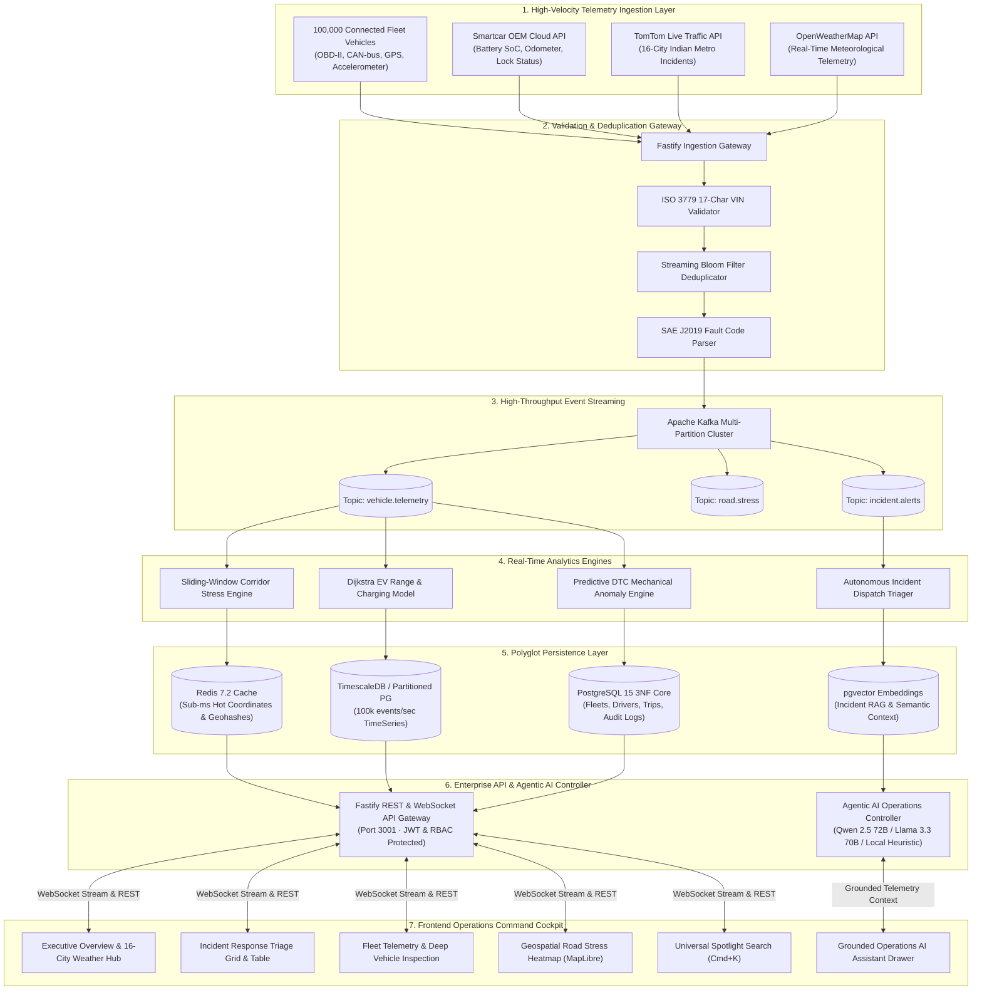

# RoadSense AI — System Architecture & Data Flow Specification

## 1. High-Level Mermaid Architecture

## 2. Ingestion & Data Flow Sequence

1. **Ingestion & Validation:** Connected vehicles emit telemetry packets containing VIN, GPS coordinate, speed, engine temperature, State-of-Charge, and DTC diagnostic codes.
2. **De-duplication & Routing:** The Fastify Ingestion Gateway checks the packet VIN against ISO 3779 specifications, de-duplicates using a Streaming Bloom Filter ($O(k)$ bit operations), and pushes to Apache Kafka topic `vehicle.telemetry`.
3. **Real-Time Stream Processing:** Stream consumers compute rolling 5-minute corridor stress averages and detect harsh braking anomalies.
4. **Polyglot Persistence:** Current vehicle states are cached in Redis (`O(1)` geohash lookups); full historical events are written to TimescaleDB monthly partitions; relational metadata is stored in PostgreSQL 3NF core.
5. **Client Broadcast:** Fastify API streams live telemetry over WebSockets to the Next.js cockpit with sub-second latency.
